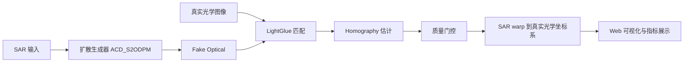

# 系统架构与代码量说明

本文档用于向导师说明当前交付包的系统架构、模块职责和有效代码规模。统计对象是：

```text
C:\Users\86158\Desktop\codxRoot\workspace\deliverables\project_effective_code_20260428
```

统计口径：只统计有效源代码和启动脚本，不把图片、CSV 实验结果、模型权重、数据库、日志、缓存计入核心代码量。

## 1. 系统总体架构

系统目标是完成 SAR 与真实光学图像的跨模态配准。整体思路是先用预训练扩散模型把 SAR 翻译为 Fake Optical，再用 LightGlue 在 Fake Optical 与真实光学图之间建立对应关系，最后把估计出的几何关系迁移回 SAR 图像，得到 SAR 到真实光学图像的配准结果。



## 2. 模块职责

| 层级 | 主要文件/目录 | 职责 |
|---|---|---|
| 表现层 | `templates/`, `static/css/`, `static/js/` | Web 控制台、内置样例展示、结果图切换、指标渲染、图片放大预览 |
| 服务层 | `workspace/code/web_app/app.py` | 登录、上传、状态检查、API 路由、任务记录、内置样例接口、实验依据接口 |
| 推理层 | `scripts/diffusion_lightglue_worker.py` | SAR 读取、扩散生成 Fake Optical、LightGlue 匹配、Homography 估计、SAR 配准输出 |
| 实验层 | `filter_registration_pairs.py`, `sweep_diffusion_lightglue_params.py`, `make_failure_contact_sheet.py` | 样本过滤、参数搜索、matcher 对比、边界案例 contact sheet |
| 数据与证据层 | `static/demo_samples/`, `diffusion_lightglue_cascade_study_100/`, `diffusion_lightglue_param_sweep/` | 答辩样例、参数搜索结果、过滤统计、论文表格依据 |
| 旧路线保留 | `models/`, `train_multiscale.py`, `training_dataset.py` | 早期 CNN 配准路线代码，仅用于说明探索过程，不作为当前主展示路线 |

## 3. 核心推理链路

1. 用户在 Web 页面选择内置样例，或上传一对 SAR / Optical 图像。
2. `app.py` 的 `/api/diffusion-register` 接口接收请求，准备任务目录和参数。
3. `app.py` 调用 `scripts/diffusion_lightglue_worker.py`，传入 SAR、真实光学图、扩散模型权重、步数和 LightGlue 参数。
4. worker 使用预训练 ACD_S2ODPM 权重生成 Fake Optical。
5. worker 使用 SuperPoint -> ALIKED 级联策略和 LightGlue 进行匹配。
6. 系统用 RANSAC 估计 Homography，并检查内点数、内点率、RMSE、空间覆盖和 Homography 形状。
7. 通过几何关系把 SAR 图像 warp 到真实光学坐标系。
8. Web 前端展示 SAR、Fake Optical、真实光学图、匹配点、配准结果、棋盘格、融合图和统计指标。

## 4. 当前有效代码量

当前统计已包含本文档之外的少量讲解型代码注释。核心代码量按 `.py`、`.js`、`.css`、`.html`、`.bat`、`.sh` 统计。

| 类型 | 文件数 | 行数 | 说明 |
|---|---:|---:|---|
| Python | 14 | 5,778 | Flask 后端、扩散推理 worker、参数搜索、样本过滤、训练与旧 CNN 模型代码 |
| JavaScript | 12 | 1,151 | Dashboard 前端逻辑、API 调用、样例加载、图片预览、历史记录 |
| CSS | 2 | 1,520 | 全局样式与答辩控制台样式 |
| HTML/Jinja | 8 | 597 | 登录页、任务详情页、Dashboard partials |
| BAT 脚本 | 4 | 106 | Windows 启动与实验脚本 |
| Shell 脚本 | 4 | 228 | Linux/远程训练启动脚本 |
| 核心有效源代码合计 | 44 | 9,380 | 不含 Markdown、JSON、CSV、PNG、数据库、缓存、模型权重 |

工程说明材料与配置文件：

| 类型 | 文件数 | 行数 | 说明 |
|---|---:|---:|---|
| Markdown | 12 | 1,654 | 启动说明、训练说明、项目过程文档、架构与代码量说明 |
| JSON | 10 | 1,230 | 内置样例 manifest、实验摘要、结果说明 |
| TXT | 2 | 22 | 轻量文本说明 |

CSV 与 PNG 属于实验结果和展示样例，不计入代码量。

## 5. 导师问答口径

**问：这个系统的架构是什么？**

答：系统分为表现层、服务层、推理层、实验层和数据证据层。表现层负责 Web 展示，服务层负责 API 和任务管理，推理层负责扩散生成与 LightGlue 配准，实验层负责样本过滤和参数搜索，数据证据层负责内置答辩样例和实验统计。

**问：核心算法在哪里？**

答：核心推理在 `scripts/diffusion_lightglue_worker.py`。它先调用预训练扩散模型把 SAR 生成 Fake Optical，再用 SuperPoint/ALIKED + LightGlue 匹配 Fake Optical 和真实光学图，随后估计 Homography，并把这个几何关系应用回 SAR 图像。

**问：Web 系统做了什么？**

答：Web 系统不是简单展示图片，而是把上传、模型状态检查、扩散推理、LightGlue 匹配、质量门控、结果可视化、内置样例和实验依据整合到一个可演示的平台里。

**问：代码量怎么算？**

答：核心有效源代码约 9.4k 行，统计的是 Python、JavaScript、CSS、HTML/Jinja 和启动脚本。图片、CSV 实验结果、模型权重、数据库、日志和缓存不计入代码量。

**问：你的主要工作量体现在哪里？**

答：主要体现在四个方面：一是把跨模态配准设计成“扩散生成 + LightGlue”的链路；二是实现 Web 推理与结果展示系统；三是做样本过滤、参数搜索和 matcher 对比；四是把实验结论固化为内置样例、指标表和可复核的质量门控。

## 6. 不计入代码量的内容

以下内容没有计入核心代码量：

```text
原始数据集 E:\Data
预训练权重 E:\checkPoint\checkPoint\checkpoint-25001-lcm-adv\model.safetensors
历史上传文件 uploads/
历史推理结果 results/
运行日志 logs/
SQLite 数据库 app_data.db
Python 缓存 __pycache__/
旧 CNN 权重 .pth
实验 CSV 和展示 PNG
```

这些内容属于数据、模型、缓存或实验产物，不属于有效源码。
